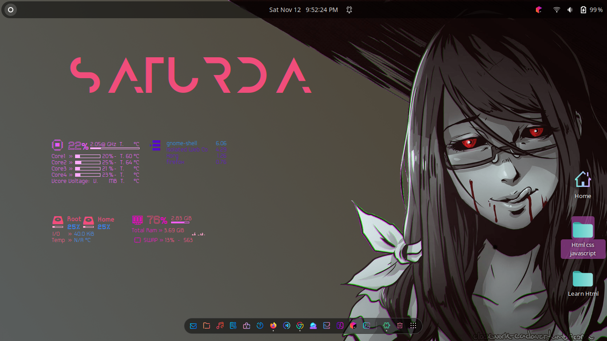

#  My first Rice style
* Dark theme Style with icons
- added more styles in theme
 
#Installation
  Please consider that it was tested only on ubuntu.
- Download the zip file
- Place zip files in /home
- configure in gnome tweaks tool .To install gnome tweaks tool by typing 
- sudo apt install gnome-tweaks
- walah your Desktop is setup.
